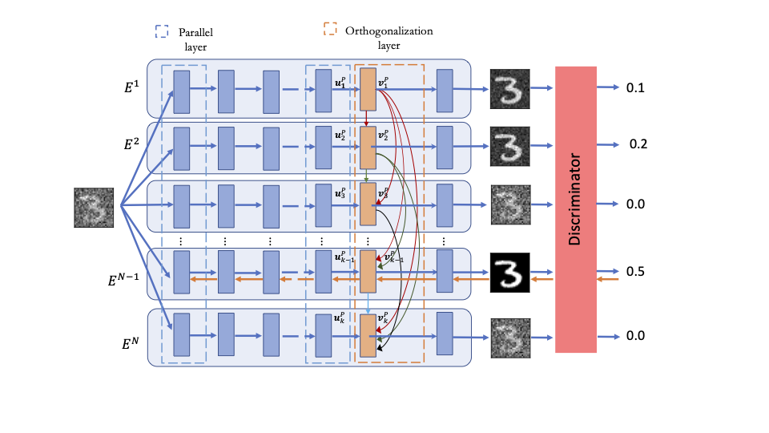

# Learning Causal Mechanisms through Orthogonal Neural Networks

Our work proposes an unsupervised method that discovers and disentangles a set of independent mechanisms from unlabeled data, and learns how to invert them. A number of experts compete against each other for individual data points in an adversarial setting: one that best inverses the (unknown) generative mechanism is the winner. We demonstrate that introducing an orthogonalization layer into the expert architectures enforces additional diversity in the outputs, leading to significantly better separability. Moreover, we propose a procedure for relocating data points between experts to further prevent any one from claiming multiple mechanisms. We experimentally illustrate that these techniques allow discovery and modularization of much less pronounced transformations, in addition to considerably faster convergence.

 

 

# Required libraries

- tensorflow 2
- numpy
- OpenCV 
- scipy
- psutil
- matplotlib

 causalPODNN.py is the main file to run.

